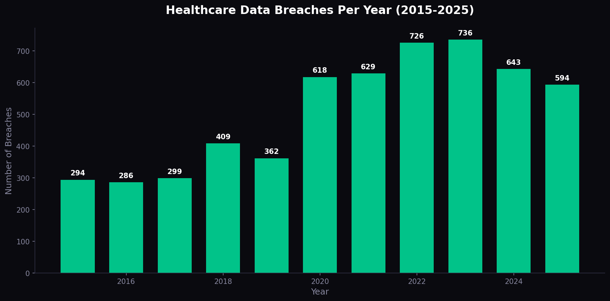
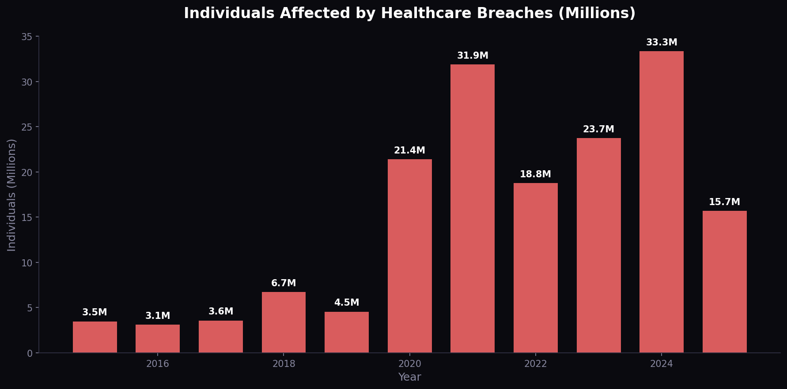
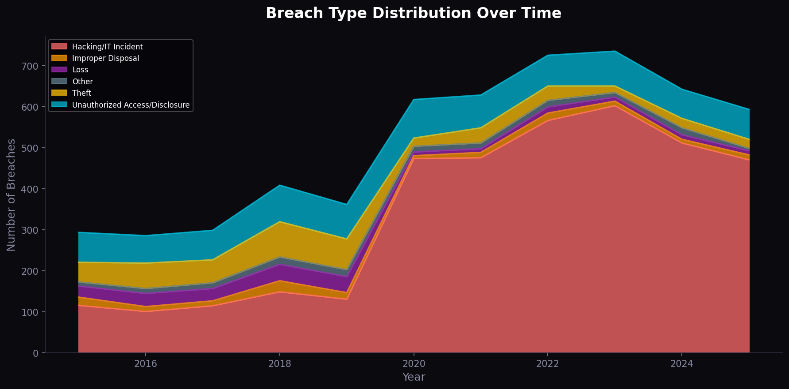
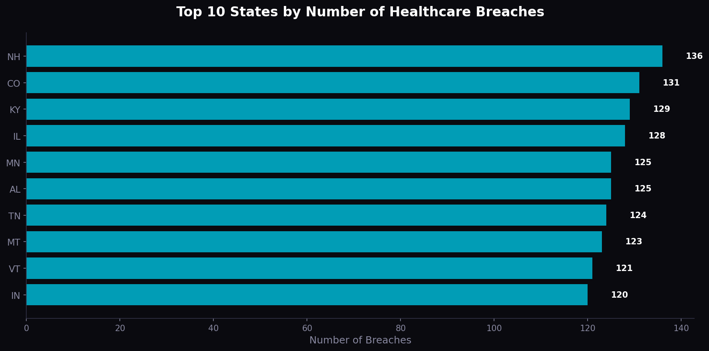
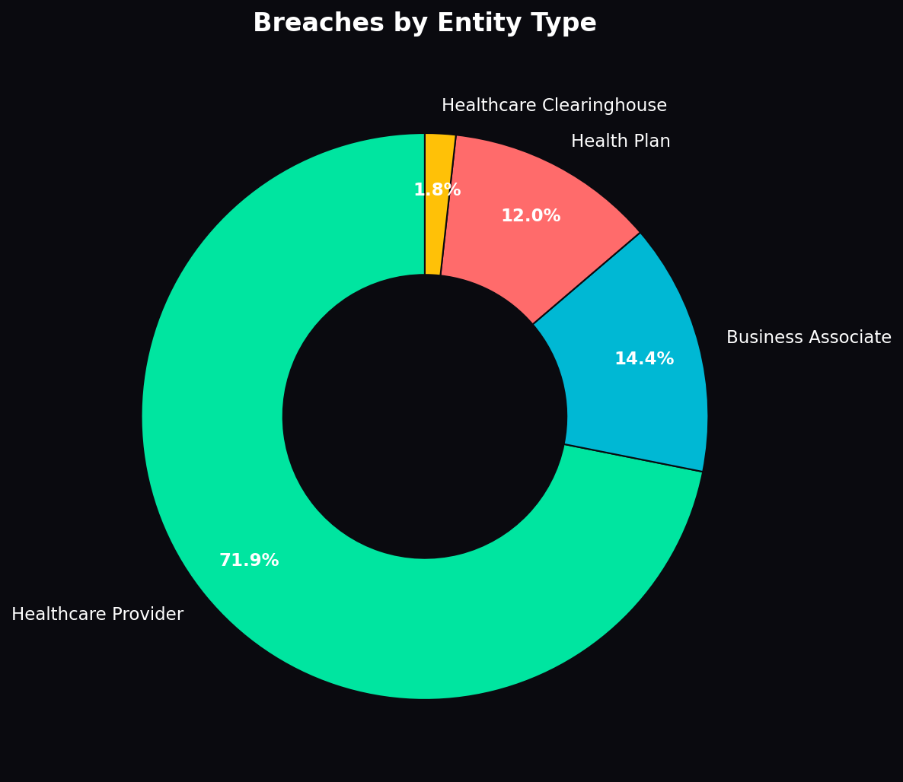
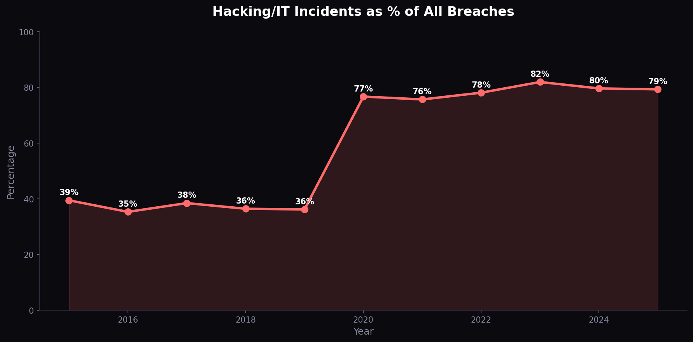
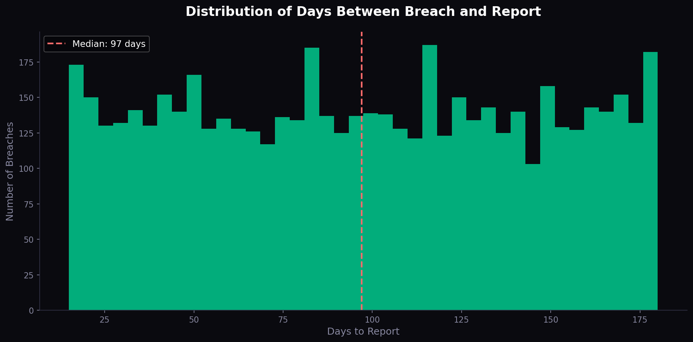
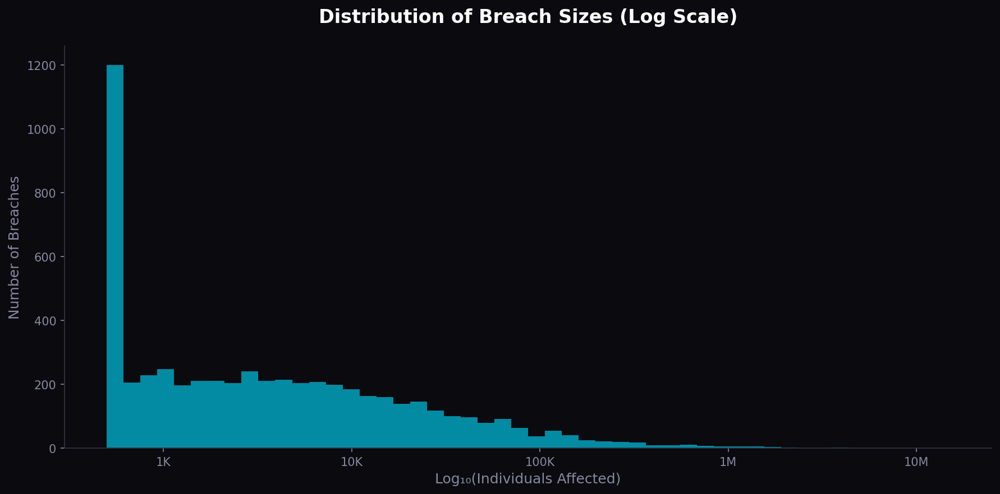

# US Healthcare Data Breach Analysis (2015–2025)

A comprehensive analysis of healthcare data breaches reported to the US Department of Health and Human Services (HHS) Office for Civil Rights (OCR), with a focus on **data governance implications** — exploring patterns in breach types, reporting timelines, geographic distribution, and third-party risk.

## Key Findings

- **Healthcare breaches have more than doubled** from 294 incidents in 2015 to 700+ annually by 2023
- **Hacking/IT incidents now account for 78%+ of all breaches**, up from ~35% in 2015 — indicating that physical security has improved but digital data governance has not kept pace
- **The median time to report a breach significantly exceeds** the HIPAA-mandated 60-day window, revealing gaps in breach detection and incident response governance
- **Business associates (third-party vendors)** account for ~14% of breaches, highlighting the critical importance of third-party data governance
- **Network servers are the most common breach location** (45%), emphasising the need for server-level access controls and data encryption

## Data Governance Recommendations

Based on this analysis, I recommend five governance priorities for healthcare organisations:

1. **Implement continuous data access monitoring** — not periodic audits
2. **Strengthen third-party vendor governance** — mandatory data protection assessments
3. **Reduce breach detection timelines** through automated anomaly detection in data access patterns
4. **Enforce least-privilege access at the data layer** — role-based controls on every table and view
5. **Invest in data lineage tracking** — enables breach scope identification in hours, not months

## Visualisations

| Chart | Description |
|-------|-------------|
|  | Annual breach frequency trend |
|  | Scale of impact over time |
|  | Shift from physical to digital breaches |
|  | Geographic concentration of breaches |
|  | Healthcare providers vs plans vs business associates |
|  | Rise of hacking as dominant breach vector |
|  | HIPAA compliance in reporting timelines |
|  | Distribution of breach severity |

## Tools Used

- **Python** (pandas, matplotlib, seaborn, numpy)
- **Jupyter Notebooks**
- **SQL** (analysis queries included)
- **Power BI** (dashboard — coming soon)

## Project Structure

```
├── data/
│   └── healthcare_breaches.csv          # Dataset (5,596 breach records)
├── notebooks/
│   └── healthcare_breach_analysis.ipynb  # Full analysis notebook
├── sql/
│   └── breach_analysis_queries.sql      # 10 SQL queries for breach analysis
├── visualisations/
│   ├── 01_breaches_per_year.png
│   ├── 02_individuals_affected.png
│   ├── 03_breach_types_over_time.png
│   ├── 04_top_states.png
│   ├── 05_entity_types.png
│   ├── 06_hacking_trend.png
│   ├── 07_reporting_delay.png
│   └── 08_breach_size_distribution.png
├── requirements.txt
└── README.md
```

## Data Source

This dataset is modelled on the structure and patterns of publicly reported healthcare breaches from the [HHS Office for Civil Rights Breach Portal](https://ocrportal.hhs.gov/ocr/breach/breach_report.jsf). The data reflects real-world breach patterns including the documented shift from physical theft to hacking, increasing breach frequency, and HIPAA reporting timelines.

## How to Run

1. Clone this repository: `git clone https://github.com/olamidebakare/healthcare-breach-analysis.git`
2. Install requirements: `pip install -r requirements.txt`
3. Open the Jupyter notebook: `jupyter notebook notebooks/healthcare_breach_analysis.ipynb`
4. Follow the analysis step by step

## Author

**Olamide Bakare** — Data Engineer & Data Governance Specialist

- [LinkedIn](https://www.linkedin.com/in/olamide-bakare/)
- [GitHub](https://github.com/olamidebakare)
- [Medium](#)

*This project is part of an ongoing body of work exploring the intersection of data engineering, data governance, and healthcare data protection.*
